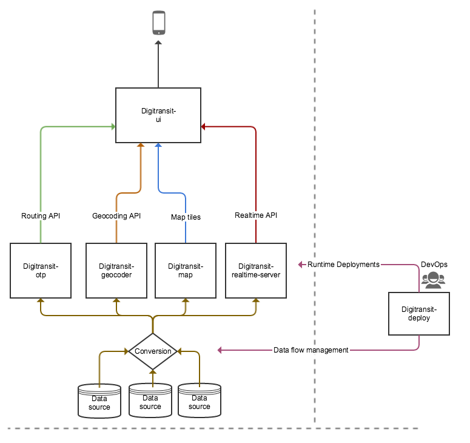

Digitransit architecture is based on microservices architecture. Microservices are small, autonomous services that work together that allow us to build larger applications on top of APIs that the services provide.

