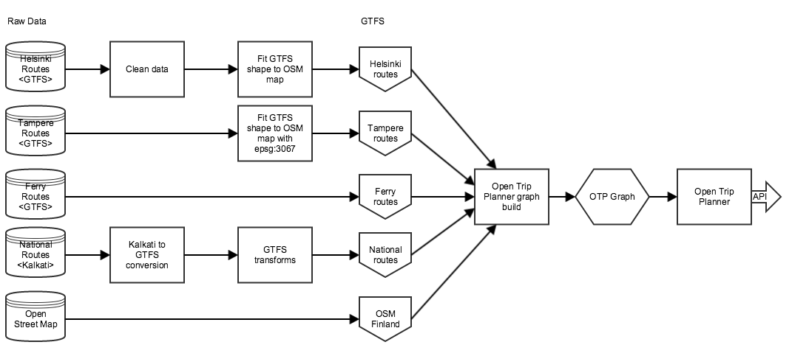
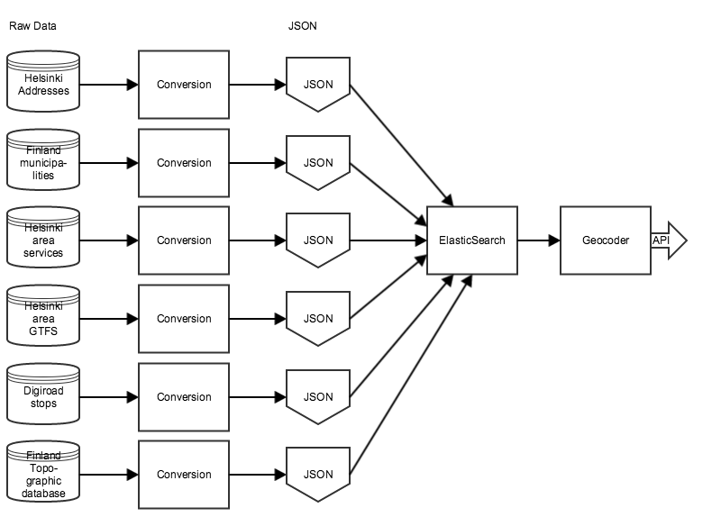
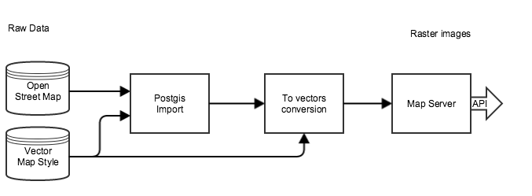

## Overview 
Goal of the data flow is to load raw data from multiple sources, convert that to different format and load it into to components. E.g. in case of Finland geocoding, raw data sources consist of Open Street Map, couple datasets form National Land Survey, and various other datasets.

## Supported data formats
There isn’t one data format that would suit all needs for Journey planning. Basically, we want to convert various data formats into 4 different groups:

1. Transportation schedules and associated geographic information.
2. Geocoding data
3. Realtime data
4. Map tile data

We start with raw data. Then, depending on component, we apply conversions in order to refine data into proper data format. After refinement, data gets loaded into component. Finally components provides loaded data through it’s API.

### Route data flow

Route data is built of the whole Finland area. First, we download raw data in various formats from Helsinki, Tampere, Oulu, etc. and this data is stored on disk. Also, we load Finnish national data from Finnish Transport Agency that contains national routes for e.g. trains. Some data is cleaned, some isn't. 

For Helsinki and Tampere data we apply GTFS shape to OSM map transformation. The purpose of this step is to better allign routes on OSM map. In different map datasources road locations can slightly vary and this step allows us to better draw routes on OSM map. Conversion is currently done using this tool: https://github.com/hannesj/gtfs_shape_mapfit.git

Finnish national data is in Kalkati-format. Our goal is to get every data into GTFS so Kalkati-to-GTFS transformation is applied using this tool: https://github.com/HSLdevcom/kalkati2gtfs

After conversion some GTFS transformations are done using OneBusAway transformer (http://developer.onebusaway.org/modules/onebusaway-gtfs-modules/1.3.4-SNAPSHOT/onebusaway-gtfs-transformer-cli.html)

Route data flow can be studied more closely here:
https://github.com/HSLdevcom/digitransit-deploy/blob/master/roles/route-server-docker-image/templates/build-routes.sh.j2

Environment dependencies can be studied more closely here:
https://github.com/HSLdevcom/digitransit-deploy/blob/master/roles/route-server-docker-image/templates/install-dependencies.sh.j2

### Geocoding data flow

Geocoder fetches data from multiple sources, converts them into JSON and loads data into ElasticSearch database. Our Geocoder API is a simple REST wrapper on ElasticSearch data. 

Geocoder API docs:
http://digitransit.fi/geocoder/

Geocoding data flow can be studied more closely here:
https://github.com/HSLdevcom/digitransit-geocoder/blob/master/scripts/import-data.sh

Different conversions can be studied more closely here:
https://github.com/HSLdevcom/digitransit-geocoder/tree/master/geocoder

Geocoder API implementation:
https://github.com/HSLdevcom/digitransit-geocoder/blob/master/geocoder/app.py

### Realtime data flow

Heavy lifting of realtime data is done in other systems. Digitransit user interface integrates to MQTT datasources in order to read realtime data from vehicles. In Helsinki city area realtime service, vehicle data is sent once every 30 seconds. Our realtime server works as a cache for MQTT datasource thus enabling user interface to query "old" realtime information and show that data immediately to user.

You might notice that currently the name of realtime server is "Navigator-server". Realtime functionality will be changing in near future and implementation details are not yet clear. Navigator-server is a proof of concept that was developed by HSL earlier.

Read more about MQTT:
http://mqtt.org/

See Realtime-server code:
https://github.com/HSLdevcom/navigator-server

### Map tile data flow

Map tile services provide Open Street Map data in two different format: 

1. Styled Raster tiles
2. Styles Vector tiles

First, OSM data is loaded into Postgis in vector format. Then two different Tessera map servers are used to serve that data as tiles.

Postgis import is done using these files:
https://github.com/HSLdevcom/digitransit-deploy/tree/master/roles/postgis-osm-docker-image/templates

Vector map server is a Tessera map server started as Docker container. See Dockerfile:
https://github.com/HSLdevcom/digitransit-deploy/blob/master/roles/vector-map-server-docker-image/templates/Dockerfile.j2

Raster map server runs also on Tessera. See Dockerfile for it:
https://github.com/HSLdevcom/digitransit-deploy/blob/master/roles/map-server-docker-image/templates/Dockerfile.j2

Vector map style can be seen here:
https://github.com/HSLdevcom/osm-bright.tm2source

Raster map style (Mapbox studio project):
https://github.com/HSLdevcom/digitransit-map

