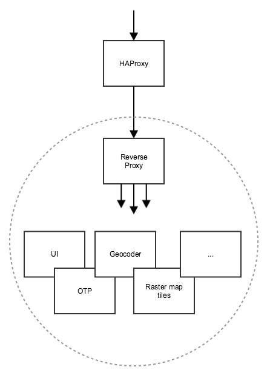
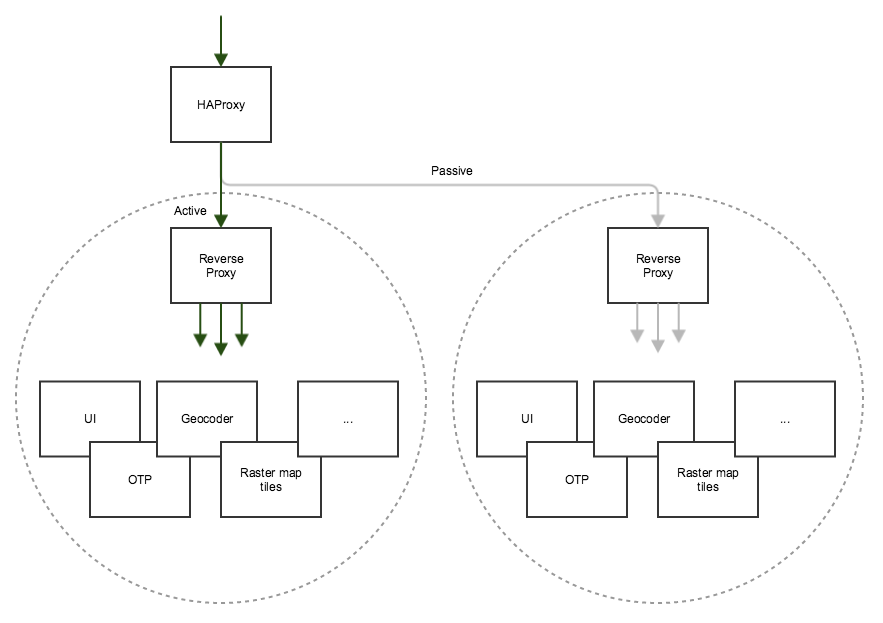

Digitransit platform components need to be weaved together to form a runtime that can be used for multimodal routing. Each component is first built as Docker image and then started as a Docker container.

Since logical entities (e.g. Map and Routing) consist of multiple containers we need a way to form a Docker compose which configures networking between containers. To get an idea how containers are linked check this out:

and then read this Docker-compose file:
https://github.com/HSLdevcom/digitransit-deploy/blob/master/roles/run/templates/docker-compose.yaml.j2

Gray circle in the image above marks what lives inside compose. HAProxy works as a load balancer for the compose.

Why do we need HAProxy in front of the compose? We actually run multiple composes in production. One called "Active" on "Passive". 

This enables us to modify components, load new data, and launch new composes without affecting Active production compose. Once we feel that new compose is ready, we do a simple flip, so that Active and Passive are changed.

At the moment we run all services in one compose but this will likely change in near future.
